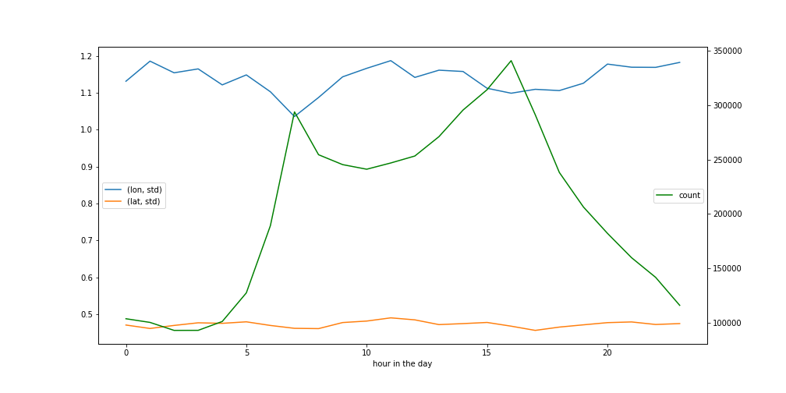

# ANET Mobility project

## Reports so far

## To play around with the data

### 1. fork and clone the repo

```
git clone https://github.com/sscu-budapest/mobility
```
(preferably fork it first)

### 2. install deps 

```
pip install -r requirements.txt
```

### 3. get the sample data


if you are using the anet server: 
```
dvc pull
```

otherwise, set up the anet server to be `anetcloud` in ssh config and then
```
dvc pull --remote anetcloud-ssh
```


### 4. load some samples and look around

```python
from src.data_dumps import ParsedCols
from src.load_samples import covid_tuesday

def total_range(s):
    return s.max() - s.min()

samp_df = covid_tuesday.get_full_df()

samp_df.groupby(ParsedCols.user).agg(
    {
        ParsedCols.lon: ["std", total_range],
        ParsedCols.lat: ["std", total_range],
        ParsedCols.dtime: ["min", "max", "count"],
    }
).agg(["mean", "median"])
```

<table border="1" class="dataframe">
  <thead>
    <tr>
      <th></th>
      <th colspan="2" halign="left">lon</th>
      <th colspan="2" halign="left">lat</th>
      <th colspan="3" halign="left">dtime</th>
    </tr>
    <tr>
      <th></th>
      <th>std</th>
      <th>total_range</th>
      <th>std</th>
      <th>total_range</th>
      <th>min</th>
      <th>max</th>
      <th>count</th>
    </tr>
  </thead>
  <tbody>
    <tr>
      <th>mean</th>
      <td>0.033919</td>
      <td>0.080638</td>
      <td>0.018890</td>
      <td>0.045475</td>
      <td>2020-11-03 07:38:23.900066048</td>
      <td>2020-11-03 18:43:00.657093888</td>
      <td>87.307432</td>
    </tr>
    <tr>
      <th>median</th>
      <td>0.001588</td>
      <td>0.000471</td>
      <td>0.001067</td>
      <td>0.000336</td>
      <td>2020-11-03 06:33:42.000000000</td>
      <td>2020-11-03 21:08:10.000000000</td>
      <td>21.000000</td>
    </tr>
  </tbody>
</table>

### + if you want to run something that can run on the full data set, I suggest using dask

```python
from src.data_dumps import ParsedCols
from src.load_samples import covid_tuesday
import matplotlib.pyplot as plt


samp_ddf = covid_tuesday.get_full_ddf()

ddf_aggs = (
    samp_ddf.assign(hour=lambda df: df[ParsedCols.dtime].dt.hour)
    .groupby("hour")
    .agg({ParsedCols.lon: ["std"], ParsedCols.lat: "std", "dtime": "count"})
    .compute()
)

fig, ax1 = plt.subplots()

ddf_aggs.iloc[:, :2].plot(figsize=(14, 7), ax=ax1, xlabel="hour in the day").legend(
    loc="center left"
)
ddf_aggs.loc[:, "dtime"].plot(figsize=(14, 7), ax=ax1.twinx(), color="green").legend(
    loc="center right"
)
```


## TODO

- "reliable user" counts
  - number of pings
  - "do we know where they live"
  - every month at least once a week
  - 30 / day (?)
  - 3 in teh morning, 3 in teh evening

- dump by month
- dump by user