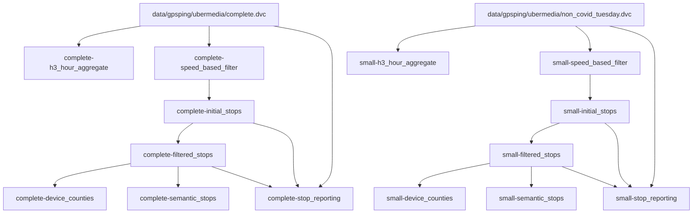

```mermaid
flowchart TD
	node1[complete-device_counties]
	node2[complete-filtered_stops]
	node3[complete-h3_hour_aggregate]
	node4[complete-initial_stops]
	node5[complete-semantic_stops]
	node6[complete-speed_based_filter]
	node7[complete-stop_reporting]
	node8[data/gpsping/ubermedia/complete.dvc]
	node2-->node1
	node2-->node5
	node2-->node7
	node4-->node2
	node4-->node7
	node6-->node4
	node8-->node3
	node8-->node6
	node8-->node7
	node9[data/gpsping/ubermedia/non_covid_tuesday.dvc]
	node10[small-device_counties]
	node11[small-filtered_stops]
	node12[small-h3_hour_aggregate]
	node13[small-initial_stops]
	node14[small-semantic_stops]
	node15[small-speed_based_filter]
	node16[small-stop_reporting]
	node9-->node12
	node9-->node15
	node9-->node16
	node11-->node10
	node11-->node14
	node11-->node16
	node13-->node11
	node13-->node16
	node15-->node13
```
