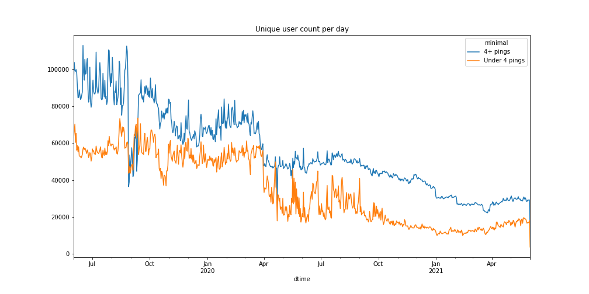
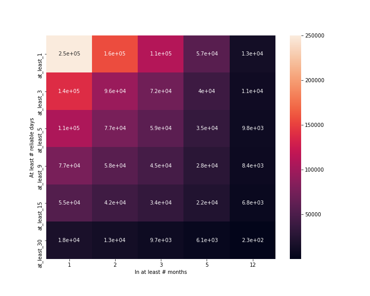
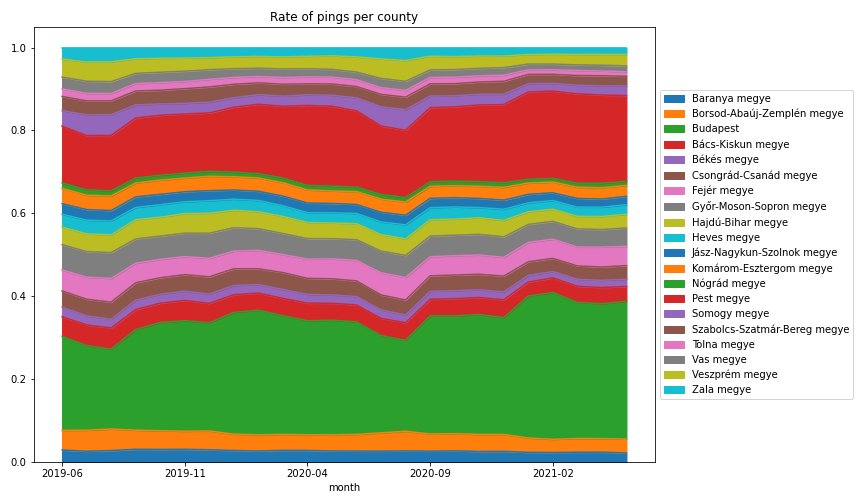

# Descriptive Report for [#1](https://github.com/sscu-budapest/mobility/issues/1)

## Unique users

## User activity

a 'reliable' user day is a day where a user has at least 5 pings between 5am and 10am, *and* at least 5 pings between 4pm and 8pm

### Users with at least # reliable days

<table border="1" class="dataframe">
  <thead>
    <tr style="text-align: right;">
      <th>Count Range</th>
      <th>User Count</th>
    </tr>
  </thead>
  <tbody>
    <tr>
      <th>[0, 2.0]</th>
      <td>4924823</td>
    </tr>
    <tr>
      <th>(2.0, 10.0]</th>
      <td>135712</td>
    </tr>
    <tr>
      <th>(10.0, 50.0]</th>
      <td>82985</td>
    </tr>
    <tr>
      <th>(50.0, 1000.0]</th>
      <td>57520</td>
    </tr>
  </tbody>
</table>

### Unique users in a month by reliable days

### User activity heatmap

### Ping rate in different counties

